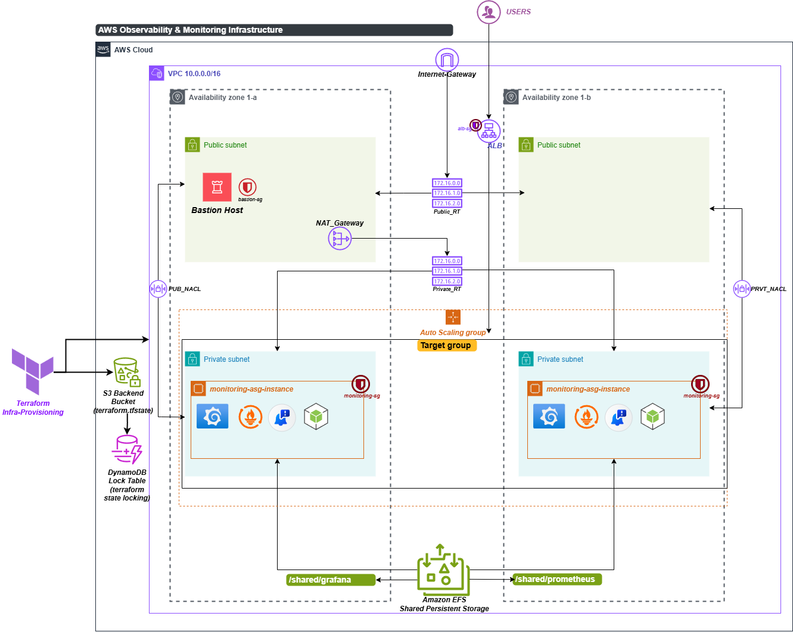

#  One-Click DevOps Observability Stack

**Production-grade monitoring infrastructure on AWS — deployed with a single Jenkins click.**

Fully automated **Infrastructure as Code** pipeline that provisions, configures, and deploys a complete observability stack (**Prometheus + Grafana + Alertmanager + Node Exporter**) on AWS using **Terraform**, **Ansible**, and **Jenkins CI/CD**.



---

## 📋 Table of Contents

- [Overview](#overview)
- [Architecture](#architecture)
- [Tech Stack](#tech-stack)
- [Project Structure](#project-structure)
- [Prerequisites](#prerequisites)
- [Getting Started](#getting-started)
  - [1. Bootstrap Remote State](#1-bootstrap-remote-state)
  - [2. Provision Infrastructure](#2-provision-infrastructure)
  - [3. Configure Services](#3-configure-services)
- [Jenkins Pipelines](#jenkins-pipelines)
- [Ansible Roles](#ansible-roles)
- [Terraform Modules](#terraform-modules)
- [Configuration Reference](#configuration-reference)
- [Teardown](#teardown)
- [Contributing](#contributing)
- [License](#license)

---

## Overview

This project implements a **one-click, end-to-end DevOps monitoring solution** on AWS. It follows modern cloud-native practices:

- **Two-stage Jenkins pipeline** — infrastructure provisioning automatically triggers service configuration
- **Immutable infrastructure** — Launch Templates + Auto Scaling Groups for self-healing monitoring nodes
- **Secure by design** — Private subnets, bastion host, NAT gateway, and restrictive security groups
- **Shared persistent storage** — Amazon EFS ensures Grafana dashboards and Prometheus data survive instance replacements
- **Remote state management** — S3 + DynamoDB backend with versioning, encryption, and state locking

---

## Architecture

| Layer | Components |
|---|---|
| **Networking** | VPC (`10.0.0.0/16`), 2 Public Subnets, 2 Private Subnets, Internet Gateway, NAT Gateway |
| **Compute** | Bastion Host (public), Auto Scaling Group with Launch Template (private) |
| **Load Balancing** | Application Load Balancer → Target Group → Grafana (port 3000) |
| **Storage** | Amazon EFS (shared `/var/lib/grafana` + `/prometheus-data`) |
| **Monitoring** | Prometheus, Grafana, Alertmanager, Node Exporter |
| **Security** | Bastion SG, ALB SG, Monitoring SG, IAM Instance Profiles |
| **State** | S3 Bucket (versioned, encrypted), DynamoDB Lock Table |
| **CI/CD** | Jenkins (2 pipelines: Infrastructure + Service Configuration) |
| **Observability** | CloudWatch integration |

### Data Flow

```
Users → ALB (Public) → Target Group → Monitoring Instances (Private)
                                         ├── Grafana     :3000
                                         ├── Prometheus   :9090
                                         ├── Alertmanager :9093
                                         └── Node Exporter:9100

Admin → Bastion (Public SSH) → Monitoring Instances (Private SSH via ProxyCommand)
```

---

## Tech Stack

| Tool | Purpose | Version |
|---|---|---|
| **Terraform** | Infrastructure provisioning | >= 1.0 |
| **Ansible** | Configuration management | Core 2.16.8 |
| **Jenkins** | CI/CD pipeline orchestration | 2.x |
| **Prometheus** | Metrics collection & alerting | 2.53.0 |
| **Grafana** | Dashboards & visualization | Latest |
| **Alertmanager** | Alert routing & notifications | Latest |
| **Node Exporter** | Host-level metrics | 1.8.2 |
| **AWS** | Cloud provider | — |

---

## Project Structure

```
one-click-devops-monitoring/
│
├── terraform-bootstrap/          # Remote state backend (run once)
│   ├── s3.tf                     # S3 bucket (versioned, encrypted, lifecycle)
│   ├── dynamodb.tf               # DynamoDB state lock table
│   ├── variables.tf
│   └── provider.tf
│
├── terraform/                    # Main infrastructure
│   ├── main.tf                   # Module orchestration
│   ├── variables.tf              # Input variables
│   ├── terraform.tfvars          # Variable values
│   ├── outputs.tf                # Bastion IP, ALB DNS, EFS ID
│   ├── backend.tf                # S3 remote backend config
│   ├── locals.tf                 # Naming conventions & tags
│   ├── data.tf                   # AMI & AZ data sources
│   ├── templates/                # Inventory template
│   ├── environments/dev/         # Environment-specific overrides
│   └── modules/
│       ├── vpc/                  # VPC
│       ├── subnet/               # Public & private subnets
│       ├── internet-gateway/     # Internet gateway
│       ├── nat-gateway/          # NAT gateway + EIP
│       ├── route-table/          # Public & private route tables
│       ├── security-group/       # Bastion, ALB, monitoring SGs
│       ├── iam/                  # Instance profile & roles
│       ├── bastion/              # Bastion EC2 instance
│       ├── efs/                  # Elastic File System
│       ├── alb/                  # Application Load Balancer
│       ├── launch-template/      # EC2 Launch Template
│       ├── autoscaling/          # Auto Scaling Group
│       └── cloudwatch/           # CloudWatch alarms
│
├── ansible/                      # Service configuration
│   ├── site.yml                  # Master playbook
│   ├── ansible.cfg               # Ansible settings
│   ├── requirements.yml          # Galaxy collections
│   ├── inventory/
│   │   ├── aws_ec2.yml           # Dynamic EC2 inventory (tag-based)
│   │   └── hosts                 # Static inventory (fallback)
│   ├── group_vars/
│   │   ├── all.yml               # Global variables
│   │   ├── bastion.yml           # Bastion-specific vars
│   │   └── monitoring.yml        # Monitoring SSH proxy config
│   └── roles/
│       ├── common/               # Base packages & OS hardening
│       ├── security/             # Firewall & security config
│       ├── node_exporter/        # Node Exporter installation
│       ├── prometheus/           # Prometheus setup & EC2 SD
│       ├── alertmanager/         # Alertmanager config
│       ├── efs/                  # EFS mount configuration
│       └── grafana/              # Grafana installation & config
│
├── jenkins/
│   ├── Jenkinsfile.infra         # Pipeline 1: Infrastructure provisioning
│   └── Jenkinsfile.ansible       # Pipeline 2: Service configuration
│
├── destroy.sh                    # Automated full teardown script
├── arch-dia.png                  # Architecture diagram
└── .gitignore
```

---

## Prerequisites

### Tools

| Requirement | Notes |
|---|---|
| AWS Account | Free Tier eligible (`t3.micro`) |
| AWS CLI | Configured with valid credentials |
| Terraform | >= 1.0 |
| Ansible | Core >= 2.16 |
| Jenkins | With pipeline, credentials, and email plugins |
| Python 3 | With `boto3` and `botocore` |
| SSH Key Pair | Created in AWS EC2 console (default: `assignment-6`) |

### Jenkins Credentials

| Credential ID | Type | Description |
|---|---|---|
| `aws-enterprise-credentials` | Username/Password | AWS Access Key ID + Secret Access Key |
| `0e6e730a-e3e3-4faf-af9c-8b74efac6efc` | SSH Private Key | EC2 SSH key for Ansible connectivity |

### Jenkins Jobs Setup

Create two pipeline jobs in Jenkins:

1. **`Infrastructure-Provisioning`** — SCM pipeline using `jenkins/Jenkinsfile.infra`
2. **`Service-Configuration`** — SCM pipeline using `jenkins/Jenkinsfile.ansible`

The infrastructure pipeline automatically triggers the service configuration pipeline on successful apply.

---

## Getting Started

### 1. Bootstrap Remote State

> **Run once** to create the S3 backend bucket and DynamoDB lock table.

```bash
cd terraform-bootstrap
terraform init
terraform apply -auto-approve
```

This creates:
- **S3 Bucket** — `buildmasters-tfstate-prod` (versioned, encrypted, lifecycle policies)
- **DynamoDB Table** — `monitoring-stack-dev-lock` (state locking with point-in-time recovery)

### 2. Provision Infrastructure

```bash
cd terraform
terraform init
terraform plan -var-file=terraform.tfvars
terraform apply -auto-approve
```

Or use the Jenkins pipeline:
1. Open **Infrastructure-Provisioning** job in Jenkins
2. Select `ACTION = apply`, `ENVIRONMENT = dev`
3. Click **Build with Parameters**

**Terraform outputs after apply:**

| Output | Description |
|---|---|
| `bastion_public_ip` | Public IP of the bastion host |
| `alb_dns_name` | DNS name to access Grafana |
| `efs_id` | EFS File System ID |
| `efs_dns_name` | EFS DNS endpoint |

### 3. Configure Services

The infrastructure pipeline automatically triggers `Service-Configuration` with the correct parameters. To run manually:

```bash
cd ansible
ansible-playbook -i inventory/aws_ec2.yml site.yml \
    -e "bastion_ip=<BASTION_IP>" \
    -e "grafana_efs_file_system_id=<EFS_ID>" \
    -e "ansible_ssh_private_key_file=~/.ssh/assignment-6.pem"
```

After deployment completes, access Grafana at:

```
http://<ALB_DNS_NAME>
```

**Default credentials:** `admin` / `admin`

---

## Jenkins Pipelines

### Pipeline 1: Infrastructure Provisioning (`Jenkinsfile.infra`)

```
Checkout → Diagnostics → Validate → CI Checks → Bootstrap → Deploy → Trigger Downstream
                                                                            ↓
                                                              Service-Configuration
```

| Parameter | Options | Description |
|---|---|---|
| `ACTION` | `apply` / `destroy` | Terraform action to perform |
| `ENVIRONMENT` | `dev` | Target environment |
| `NOTIFICATION_EMAIL` | Email address | Status notifications via SMTP |

**Key features:**
- Terraform `fmt`, `init`, and `validate` as CI checks
- Automatic bootstrap of S3/DynamoDB backend
- Email notifications on success/failure
- One-click teardown via `destroy` action

### Pipeline 2: Service Configuration (`Jenkinsfile.ansible`)

```
Checkout → Diagnostics → Validate → Install Dependencies → Install Collections → Syntax Check → Deploy
```

| Parameter | Description |
|---|---|
| `BASTION_IP` | Public IP of the bastion host (auto-filled from upstream) |
| `EFS_ID` | EFS File System ID (auto-filled from upstream) |
| `ENVIRONMENT` | Target environment |
| `ALB_DNS_NAME` | ALB DNS for Grafana URL in notifications |
| `NOTIFICATION_EMAIL` | Status notifications |

**Key features:**
- Input validation (IP format, EFS ID format, email format)
- Ansible syntax check before deployment
- SSH proxy via bastion for private subnet connectivity
- Dynamic EC2 inventory using AWS tags

---

## Ansible Roles

| Role | Description |
|---|---|
| `common` | Base packages, OS updates, system tuning |
| `security` | Firewall rules, SSH hardening |
| `node_exporter` | Install & configure Node Exporter `v1.8.2` |
| `prometheus` | Install Prometheus `v2.53.0` with EC2 service discovery |
| `alertmanager` | Alert routing and notification configuration |
| `efs` | Mount EFS for shared Grafana + Prometheus storage |
| `grafana` | Install Grafana, configure datasources and dashboards |

### Execution Order

```
1. Wait for SSH + Python  →  All hosts
2. Common + Security      →  Bastion
3. Common + Security      →  Monitoring nodes
4. Node Exporter          →  Monitoring nodes
5. Prometheus             →  Monitoring nodes
6. Alertmanager           →  Monitoring nodes
7. EFS Mount              →  Monitoring nodes
8. Grafana                →  Monitoring nodes
```

---

## Terraform Modules

| Module | Resources Created |
|---|---|
| `vpc` | VPC with DNS support |
| `subnet` | Public/Private subnets across 2 AZs |
| `internet-gateway` | Internet Gateway |
| `nat-gateway` | NAT Gateway + Elastic IP |
| `route-table` | Public (IGW) + Private (NAT) route tables |
| `security-group` | Bastion SG, ALB SG, Monitoring SG |
| `iam` | IAM Role + Instance Profile (SSM, CloudWatch) |
| `bastion` | EC2 bastion host in public subnet |
| `efs` | EFS + mount targets in private subnets |
| `alb` | ALB + Target Group + Listener (HTTP → Grafana) |
| `launch-template` | EC2 Launch Template with user data |
| `autoscaling` | ASG (min/desired/max = 2) attached to ALB TG |
| `cloudwatch` | CloudWatch alarms and dashboards |

---

## Configuration Reference

### Key Variables (`terraform.tfvars`)

| Variable | Default | Description |
|---|---|---|
| `aws_region` | `us-east-1` | AWS deployment region |
| `environment` | `dev` | Environment name |
| `instance_type` | `t3.micro` | EC2 instance type (Free Tier) |
| `key_name` | `assignment-6` | SSH key pair name |
| `grafana_port` | `3000` | Grafana HTTP port |
| `prometheus_port` | `9090` | Prometheus HTTP port |
| `node_exporter_port` | `9100` | Node Exporter port |
| `asg_min_size` | `2` | ASG minimum capacity |
| `asg_desired_capacity` | `2` | ASG desired capacity |
| `asg_max_size` | `2` | ASG maximum capacity |

### Ansible Variables (`group_vars/all.yml`)

| Variable | Default | Description |
|---|---|---|
| `prometheus_version` | `2.53.0` | Prometheus release version |
| `node_exporter_version` | `1.8.2` | Node Exporter release version |
| `grafana_admin_user` | `admin` | Grafana admin username |
| `grafana_admin_password` | `admin` | Grafana admin password |
| `prometheus_scrape_interval` | `15s` | Prometheus scrape interval |
| `prometheus_retention_time` | `15d` | Metrics retention period |
| `prometheus_ec2_sd_enabled` | `true` | AWS EC2 service discovery |

---

## Teardown

### Option 1: Jenkins (Recommended)

1. Open **Infrastructure-Provisioning** job
2. Select `ACTION = destroy`
3. Click **Build with Parameters**

### Option 2: Automated Script

```bash
bash destroy.sh
```

This script performs a complete cleanup:
1. Destroys main Terraform infrastructure
2. Disables `prevent_destroy` on bootstrap resources
3. Destroys bootstrap S3 bucket and DynamoDB table
4. Purges versioned S3 objects via Python/boto3
5. Verifies clean AWS state

### Option 3: Manual

```bash
# Destroy main stack
cd terraform
terraform init
terraform destroy -auto-approve -var environment=dev

# Destroy bootstrap
cd ../terraform-bootstrap
terraform destroy -auto-approve
```

---

## Contributing

1. Fork the repository
2. Create a feature branch (`git checkout -b feature/amazing-feature`)
3. Commit your changes (`git commit -m 'Add amazing feature'`)
4. Push to the branch (`git push origin feature/amazing-feature`)
5. Open a Pull Request

---

## License

This project is open source and available under the [MIT License](LICENSE).

---

<p align="center">
  Built with ❤️ by <strong>Yogesh Singh</strong>
</p>
